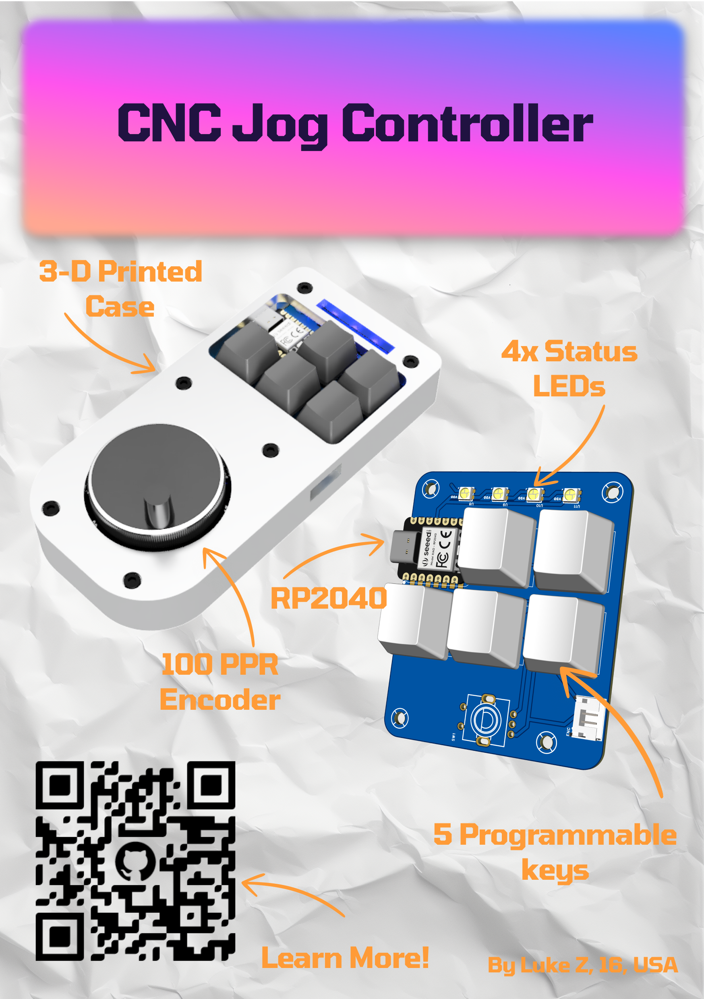

# RP2040 powered CNC Jog Controller

## What is this?
This is a custom jog controller I made used to manually move CNC machines with a handheld encoder
## Why did I make this?
I use a CNC machine often to manufacture parts out of alumium and other metals, and I find it tedious to set up work coordinates and probing by clicking buttons on my screen with a trackpad.   
I designed this as an easier alternative. This will remove the need for me to look back and forth between machine and computer as I can just hold this controller by my machine. The large rotary encoder also allows for easy input.
## How to use it?
Look for hardware directions [here](pcb/) and software instructions [here](code/)
### Currently Compatible with:
- CNCjs
