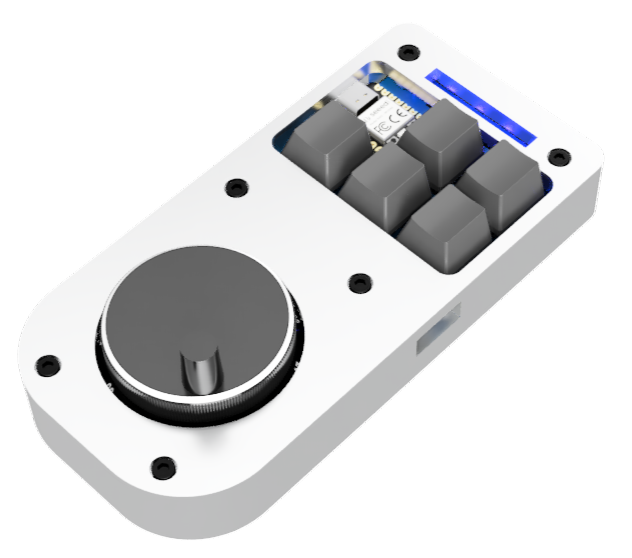

# Case

## Hardware
To assemble the case, you need:    
- 6x M3x14 socket head bolts
## Manufacturing
### 3D printing
The easiest and most accessible way is to 3D print the case.    
- Print [case top](./case%20top%20v4.step) and [case bottom](./case%20bottom%20v2.step)    

Most default print settings with PLA or PETG should be fine.    
### CNC Machining
If you have a CNC machine and want to make your case out of aluminum, I have CAM toolpaths set up for the case models. Adjust tooling and parameters to fit your machine.
