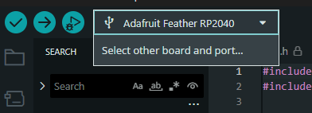
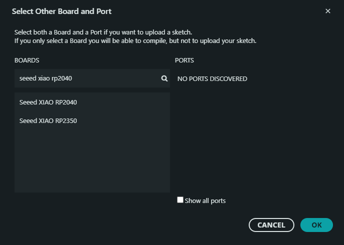

# Controller Code
## Setup
1. Follow [this guide](https://learn.adafruit.com/adafruit-feather-rp2040-pico/arduino-ide-setup) from Adafruit to install the RP2040 into Arduino IDE
2. Select XIAO RP2040

3. Now you can plug in your rp2040 and upload code!