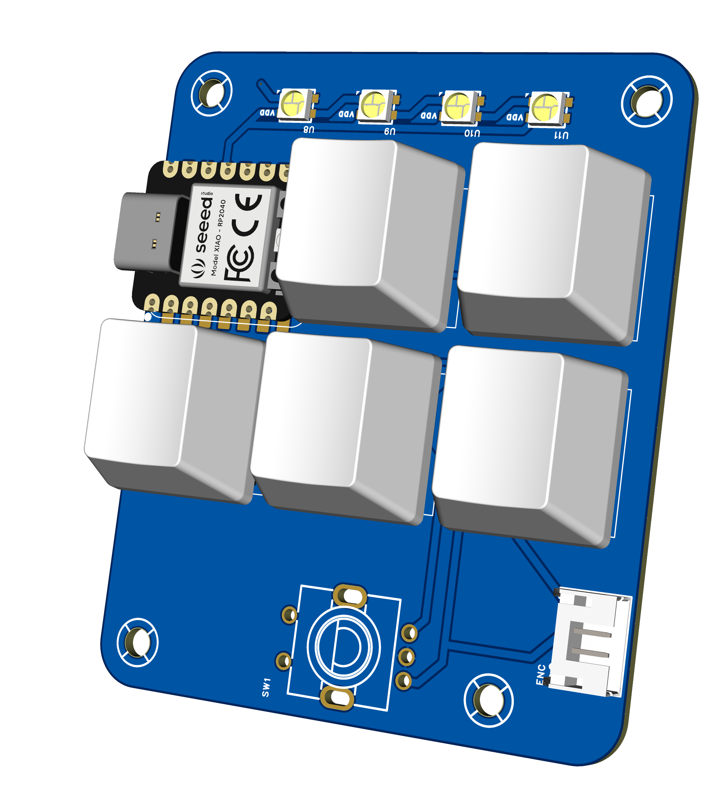
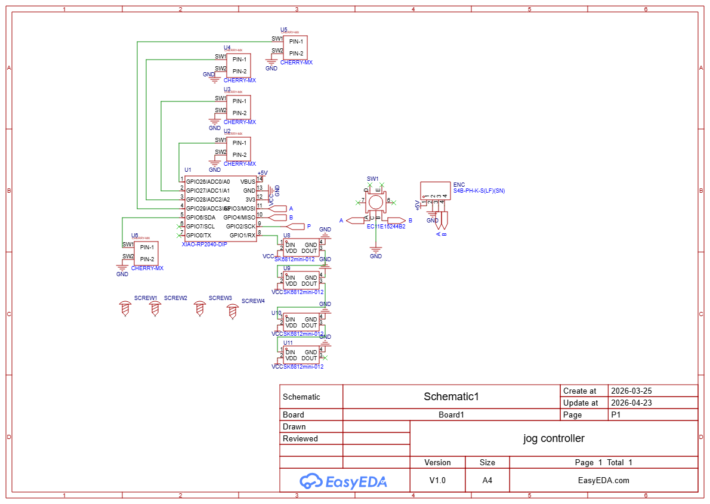

# PCB

## BOM
| Part Name                   | Qty | Primary Link                                             | Secondary Link                                       |
|-----------------------------|-----|---------------------------|---------------------------------|
| JST connector               | 1   | https://www.lcsc.com/product-detail/C157926.html         |                                                      |
| 100PPR Rotary Encoder       | 1   | https://www.aliexpress.us/item/3256804251537752.html     |                                                      |
| XIAO RP2040                 | 1   | https://www.seeedstudio.com/XIAO-RP2040-v1-0-p-5026.html |                                                      |
| CHERRY MX Keyboard Switches | 5   | https://www.lcsc.com/product-detail/CPG151101D01.html    | https://www.aliexpress.us/item/3256806811817309.html |
| SK6812-mini LEDs            | 4   | https://www.lcsc.com/product-detail/C2886570.html        |                                                      |
| Cherry MX Key Caps          | 5   | Your Choice!                                             | https://www.aliexpress.us/item/3256802719703092.html |

You may also need **JST PH** cables to connect the PCB to the encoder. If you don't have them, you can either solder wires directly to the PCB without the connector, buy [premade cables](https://www.aliexpress.us/item/3256801422042633.html) (PH 2.0mm 10CM 4P), or [crimp your own](https://www.aliexpress.us/item/3256807505634549.html) (PH 2.0)
## Assembly
1. Solder SMD LEDs
2. Solder Key switches
3. Solder XIAO RP2040 with pin headers
4. Solder JST-PH 4P connector (If you're using it)
# Schematic
